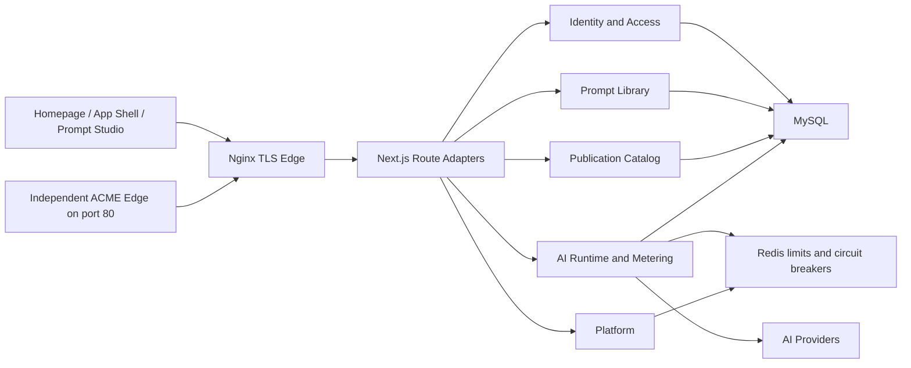

# NotePrompt SOTA Upgrade Execution Plan

Date: 2026-07-16
Status: Active
Owner: NotePrompt maintainers
Product baseline: [`PRODUCT.md`](../../PRODUCT.md)
Design baseline: [`DESIGN.md`](../../DESIGN.md)
Architecture decisions: [`docs/adr/README.md`](../adr/README.md)

## 1. Purpose

This document is the implementation ledger for turning NotePrompt into a top-tier personal prompt production tool. It distinguishes current behavior from accepted target behavior so roadmap language cannot be mistaken for deployed functionality.

The repository at `computersciencefreshmen/NotePrompt` is the only code source of truth. Every database change is a new forward migration. Every release is built from a full commit SHA. Every implementation batch is reviewed, tested, committed, pushed, and returned to a clean worktree before another batch starts.

## 2. Product target and non-goals

### Target

- Keep the current homepage structure and brand character.
- Make a unified Prompt Studio the authenticated product center.
- Serve individual developers, researchers, and content or operations professionals.
- Treat prompts as structured, versioned, private-by-default assets.
- Make publication, import, collection membership, AI usage, and deployment state explicit and auditable.
- Continue as a Next.js modular monolith on one Alibaba Cloud ECS.

### Non-goals

- Team workspaces or organization permissions.
- Payments, subscriptions, invoices, or a billing platform.
- Real-time multi-user collaboration.
- Kubernetes, microservices, or multi-region infrastructure.
- A third visual theme beyond resolved light and dark. A system preference may choose between those two themes.

The homepage currently contains Team and commercial roadmap language. That content is legacy product drift, not an accepted commitment. Phase 5 preserves the homepage structure while removing conflicting promises.

## 3. Current baseline

At commit `c40b9d879fb61c91d650a9ba1013104ae2c69791`:

- Public `/api/live` is dependency-free liveness.
- Public Nginx returns 404 for `/api/health` and `/api/v1/health-check` without trusting RFC1918 source addresses.
- Container readiness reuses the application MySQL pool and coalesces concurrent probes with a two-second success and failure cache.
- Local lint, 115-test suite, production build, high-severity production dependency audit, and Compose static validation pass. One real-MySQL migration smoke test remains opt-in because `MYSQL_MIGRATION_TEST_DATABASE` is not configured locally.
- Migrations `001` through `009` are the applied schema history. They are immutable.
- Curated catalog identity is already separated from user publication identity by ADR-0001.
- Public folder publication is already a materialized snapshot.
- Imported public folders, durable AI reservations, separate account plan and role, revision-safe drafts, the unified App Shell, and Prompt Studio are target behavior, not current behavior.

## 4. Target architecture



The five internal modules remain one deployment unit and one relational database:

| Module | Owns | Must not own |
| --- | --- | --- |
| Identity and Access | accounts, authentication, sessions, plan, role, suspension, capabilities | private prompt reads by administrator status alone |
| Prompt Library | private prompts, revisions, checkpoints, collections, imported copies | public catalog ranking or provider dispatch |
| Publication Catalog | user publication snapshots, curated catalog, discovery, moderation | mutable private prompt projections |
| AI Runtime and Metering | provider dispatch, attachments, limits, durable usage reservations | account role or prompt ownership policy |
| Platform | health, configuration, release identity, logging, migrations, operational adapters | product domain decisions |

Route adapters only parse HTTP, authenticate, validate with Zod, call an application service, and map an error to a response. Repositories own SQL and always carry tenant or owner constraints for private data.

## 5. Execution ledger

| Stage | Atomic batch | Status | Exit gate |
| --- | --- | --- | --- |
| 0 | `security: isolate public liveness from private readiness` | Complete at `c40b9d8` | Public liveness works, public readiness is 404, private readiness and cache tests pass |
| 1A | `docs: define SOTA product and architecture baseline` | Complete at `3892108` | Product, design, plan, ADRs reviewed and documentation tests pass |
| 1B | `ci: enforce release quality and security gates` | Implemented; blocked on 1C history cleanup | Node 24 lint/test/build, real MySQL migration, Docker build, audit, Gitleaks, and Trivy enforced |
| 1C | Credential rotation and full-history rewrite | External security window | All affected credentials revoked, all-history Gitleaks clean, coordinated force-push complete |
| 2A | `core: give publications stable source identity` | Pending | Migration 010 passes empty, legacy, and replay tests; same-source publish is atomic and idempotent |
| 2B | `security: separate moderation from private content` | Pending | Cross-user and administrator privacy tests pass |
| 2C | `core: canonicalize prompt collections` | Pending | Canonical relation is active, legacy projection containment and same-tenant integrity stay clean, and no supported code depends on `folder_id` |
| 3 | Alibaba Cloud deployment baseline | External maintenance window | Backup restore proven, SHA identity matches, 3306 closed, 72-hour observation complete |
| 4A | `core: materialize imported collection snapshots` | Pending | Source changes and deletion cannot affect an imported copy |
| 4B | `core: separate account plan and role` | Pending | Migration 013 and authorization compatibility tests pass |
| 4C | `core: persist AI usage reservations` | Pending | Crash, retry, timeout, and reconciliation tests prove idempotent accounting |
| 4D | `refactor: extract modular application services` | Pending | Route adapters contain no product SQL; module contract tests pass |
| 5A | `core: add revision-safe prompt drafts` | Pending | Expected-revision autosave returns 409 on conflict and never silently overwrites |
| 5B | `ui: establish the product shell` | Pending | App Shell, two themes, WCAG paths, and visual baseline pass |
| 5C | `ui: unify the prompt studio` | Pending | Create, edit, optimize, compare, checkpoint, and recover work end to end |
| 5D | `ui: consolidate discover settings and admin` | Pending | Duplicated IA is removed and administrator privacy boundaries remain intact |

Stages 1C and 3 require production authority, secret owners, a maintenance window, and verified backups. They cannot be completed by a source-code commit alone.

## 6. Migration program

Every migration uses expand, cutover, and contract. A migration must be safe on an empty database, a supported legacy fixture, and repeated execution. MySQL DDL can commit implicitly, so migrations are forward-only and restartable. A verified backup is the rollback mechanism when a change cannot be resumed.

| Version | Expand | Cutover | Contract |
| --- | --- | --- | --- |
| 010 | Add nullable unique publication `source_prompt_id`, `publication_state=published\|withdrawn`, structured snapshot fields, and `ON DELETE SET NULL` provenance | Conservatively backfill only exact one-to-one rows; lock the source by `id + user_id`; publish the complete snapshot through source identity | Remove title-based source inference after one compatibility release |
| 011 | Add tenant key and same-tenant integrity to collection membership | Read and write canonical `collection_ids`; keep singular `folder_id` as a documented lossy primary projection and measure containment invariants | Drop legacy `user_prompts.folder_id` only after no legacy-only row or supported code dependency remains |
| 012 | Add imported collection and prompt snapshot rows plus nullable provenance | Materialize copies transactionally with retry-safe import operation identity | Remove live imported-folder projection after imported data parity is proven |
| 013 | Add `plan`, `role`, and suspension state independently | Map `free/pro/admin`, `is_admin`, and `admin_disabled_at` conservatively | Remove mixed `user_type` semantics after clients use the new account DTO |
| 014 | Add durable AI reservation and transition history | Reserve before dispatch, commit after dispatch, refund only before dispatch, reconcile timeouts | Remove aggregate-first compensation paths after ledger parity is proven |
| 015 | Add current prompt revision, draft compare-and-swap, and checkpoint metadata | Autosave with expected revision; create history only for manual checkpoint or accepted AI result | Redirect legacy editor flows after Studio reaches parity |

Each migration batch also updates `database/schema-requirements.json`, schema dependency documentation, the offline structural tests, a real MySQL empty-schema test, a legacy fixture test, and replay assertions. Applied migrations and integrity manifests are never edited.

## 7. Domain and API contracts

| Contract | Accepted behavior |
| --- | --- |
| `/api/live` | Public liveness; no database, Redis, storage, or provider dependency |
| `/api/health` | Container-private readiness; public edge returns 404 |
| Prompt read/update/delete | Private query includes both resource ID and authenticated user ID; unauthorized and absent both return 404 |
| Prompt publication | Public snapshot is identified by public ID and nullable unique private source; source lookup locks `id + user_id`; same source republishes the complete structured snapshot atomically; lifecycle is `published` or `withdrawn` |
| Curated identity | Remains `curated:<id>` and never shares the `public_prompts` AUTO_INCREMENT domain |
| Collection membership | Canonical explicit `collection_ids`; legacy singular `folder_id` is a one-version lossy primary projection and never represents the full set |
| Imported collection | Materialized independent private copy; source update or deletion never mutates or cascades into it |
| Prompt draft | Compare-and-swap with expected revision; stale write returns 409 |
| Prompt checkpoint | Created only by manual checkpoint or accepting an AI result, not every autosave |
| AI reservation | Persistent, retry-safe state machine keyed by reservation ID and idempotency key |
| Account DTO | `plan`, `role`, and `suspension` are independent; administrator role grants no implicit private-content read |
| Moderation | Reads published catalog content only; private-content audit remains unavailable |

## 8. CI and release quality gates

### Current local gates

```bash
npm ci
npm run lint
npm test
npm run build
npm audit --omit=dev --audit-level=high
npm run db:plan
docker compose --env-file <non-secret-ci-env> config --quiet
docker compose -f compose.acme.yml --env-file <non-secret-ci-env> config --quiet
```

`npm run check` means lint plus tests only. The authoritative Linux release contract is [`.github/workflows/release-quality.yml`](../../.github/workflows/release-quality.yml), documented in [`release-quality-gates.md`](../engineering/release-quality-gates.md).

### Phase 1B enforced gates

- Node 24 with `npm ci`.
- TypeScript and ESLint with zero warnings.
- Full Node unit and contract suite.
- MySQL 8 service test that applies all migrations twice to a fresh schema.
- Supported legacy-schema fixture migrations for 010 through 015.
- Production Next.js build and standalone-secret sanitization checks.
- Docker image build with full SHA metadata.
- `npm audit --omit=dev --audit-level=high` with zero critical or high production advisories.
- Gitleaks on the full fetched history.
- Trivy filesystem and image scans with zero critical or high findings.
- Compose static validation.

### Final product gates

- Unit, MySQL and Redis integration, migration, cross-user authorization, Playwright E2E, visual regression, and Axe.
- E2E covers registration, login, create, autosave, conflict, AI optimization, checkpoint and restore, publish, discover, import, collections, settings, and administrator privacy.
- WCAG 2.2 AA with complete keyboard paths, reliable focus, accessible names, reduced motion, non-color state, and 44px mobile targets.
- Homepage LCP at or below 2.5 seconds, CLS at or below 0.1, and INP at or below 200 milliseconds.
- Lighthouse Performance at least 90 and Accessibility at least 95 on agreed pages and hardware profile.
- Shared initial JavaScript at or below 120kB, asset workbench at or below 180kB, and Studio at or below 230kB. Editor, OCR, document parsing, and diff tooling load on demand.
- Ordinary API traffic at 10 requests per second for 10 minutes has p95 at or below 500 milliseconds and less than one percent 5xx; five concurrent AI streams remain supported.
- AI first streamed byte p95 at or below five seconds; 95 percent of provider-accepted requests finish within 180 seconds.

## 9. Production cutover and SLO

The accepted operating target is one ECS at 99.5 percent monthly availability, RPO 24 hours, and RTO 4 hours. This is a target to measure after deployment, not a claim that the current production system already meets it.

Before cutover:

1. Rotate or revoke all exposed SSH, MySQL, administrator, SMTP, AI, JWT, and related credentials.
2. Prove an off-host backup can be restored into an isolated database.
3. Record the current database state, image ID, Git SHA, certificate fingerprint, and rollback decision point.
4. Build an immutable image from the full target SHA and verify OCI revision metadata.
5. Validate migrations against the restored database.

During the maintenance window:

1. Stop writes and create a final verified backup.
2. Keep the independent ACME edge on port 80.
3. Run one-shot migrations using the dedicated migration principal.
4. Start the application and 443 business Nginx with `--no-build --wait`.
5. Prove Git SHA, image tag, OCI revision, and private health version are identical.
6. Run login, private read, create, edit, publish, liveness, readiness, Redis, and TLS smoke checks.
7. Roll back within the documented threshold if the new version is not healthy within 180 seconds or schema compatibility cannot be proven.

After cutover:

- Remove Alibaba Cloud security-group and firewalld access to 3306 first.
- In a separate window, remove the MySQL Docker `0.0.0.0:3306` publication after private connectivity is verified.
- Observe normal and AI traffic for 72 hours before deploying another product batch.
- Run daily off-host backups, monthly restore exercises, and 30, 14, and 7 day public certificate-expiry alerts.

## 10. Atomic batch protocol

For every batch:

1. Confirm the batch scope and keep unrelated user changes untouched.
2. Add or update tests before or with implementation.
3. Run the smallest relevant tests while iterating.
4. Run lint, the full test suite, build, audit, migration checks, and Compose checks in proportion to the batch risk.
5. Review `git diff`, `git diff --check`, generated files, secrets, and migration compatibility.
6. Stage only the batch files.
7. Create one intentional commit with the approved message.
8. Push the current branch.
9. Verify local HEAD equals upstream and `git status --short` is empty.

Database migrations, UI redesign, production deployment, and destructive history rewriting never share one commit or maintenance action.

## 11. Completion definition

The SOTA program is complete only when:

- No P0 or P1 security finding remains open.
- Production dependencies have no critical or high advisory.
- Full Git history contains no active or revoked secret material detectable by the agreed scanner.
- All public and private ownership boundaries have automated cross-user tests.
- Migrations 010 through 015 pass empty, legacy, and replay testing.
- Prompt Studio is the coherent create, edit, optimize, compare, checkpoint, publish, and reuse experience.
- Light and dark use one semantic design system and meet WCAG 2.2 AA.
- CI enforces the documented release gates.
- Production is running the verified SHA image, 3306 and 6379 are private, backup restoration is rehearsed, and the 72-hour observation window is clean.
- The worktree is clean and every atomic batch is available on the remote branch.
